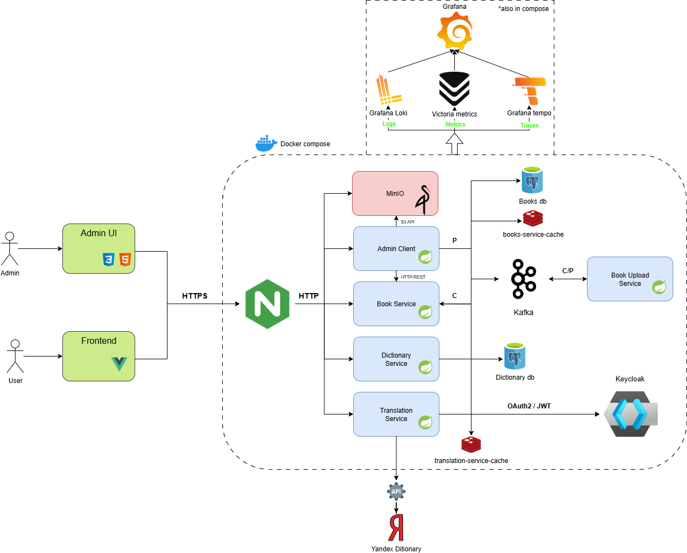

[](README.md)
[](README.ru.md)
# Parallel Reading

## Содержание
- [Архитектура](#архитектура)
    - [Сервисы](#сервисы)
    - [Инфраструктура](#инфраструктура)
    - [Профили Spring](#профили-spring)
- [Быстрый старт с Docker Compose](#быстрый-старт-с-docker-compose)
- [Prod сборка](#prod-сборка)

Платформа для параллельного чтения книг на иностранных языках со встроенным словарем и системой флэш-карт

## Архитектура



### Сервисы

Система состоит из следующих микросервисов:

1) **Book Service** - управление книгами, главами и страницами книг
2) **Translation Service** - перевод слов с помощью [Yandex Dictionary API](https://yandex.ru/dev/dictionary/). Использует [StanfordNLP](https://nlp.stanford.edu/) для лемматизации слов
3) **Dictionary Service** - управление пользовательскими флэшкартами и словарём, реализует алгоритм SuperMemo 2 для интервального повторения
4) **Book Upload Service** - парсинг текста книг с помощью [Apache OpenNLP](https://opennlp.apache.org/)
5) **Auth Service** - регистрацию пользователей, сброс пароля и т.д.
6) **Admin Client** - веб-интерфейс для администраторов

**Frontend app** (Vue.js 3, Typescript, Vite, TailWind): https://github.com/TVFK/parallel-reading-frontend

### Инфраструктура

1) **PostgreSQL** - основное хранилище данных 
2) **Redis** - кэширование часто запрашиваемых данных
3) **Kafka** - асинхронная коммуникацию и event-sourcing
4) **MinIO** - хранит обложки книги и текста книги
5) **Keycloak** - OAuth 2.0/OIDC аутентификация
6) **Nginx** - обратный прокси и раздача статического контента
7) **Victoria Metrics** - сбор метрик
8) **Grafana Loki** - сбор логов
9) **Grafana Tempo** - сбор трассировок
10) **Grafana** - визуализация метрик, логов и трассировок

### Профили Spring

1) **standalone** - для локального запуска Spring сервисов без Docker
2) **docker** - локальный запуск всех сервисов без HTTPS, nginx, мониторинга и т.д.
3) **prod** - для запуска в продакшн

## Быстрый старт с Docker Compose

Всё приложение можно запустить локально при помощи файла **compose.yaml**, все сервисы будут развёрнуты на localhost

1. **Клонирование репозитория**

```shell
git clone https://github.com/TVFK/parallel-reading.git
```
2. **Сбор проекта**

```shell
mvn clean package -DskipTests
```

3. **Запуск всех сервисов**

```shell
docker-compose up -d --build
```
Приложение будет доступно по адресу: http://localhost

Интерфейс админа: http://localhost:8083

Интерфейс MinIO: http://localhost:9090

Интерфейс Keycloak: http://localhost:8082

### Переменные окружения

Translation service необходимо:
```env
YANDEX_DICT_API_KEY=your_yandex_dictionary_key
```
API ключ для Yandex Dictionary можно получить по этому адресу https://yandex.ru/dev/dictionary/

## Prod сборка

1. **Клонирование репозитория**

```shell
git clone https://github.com/TVFK/parallel-reading.git
```

2. **Создание переменных окружения**

В корне проекта рядом с **compose.prod.yaml** необходимо создать файл **.env** с данными переменными:

```text
BASE_URL=
DOMAIN=

# Keycloak variables
KEYCLOAK_DB_PASSWORD=
KEYCLOAK_ADMIN_LOGIN=
KEYCLOAK_ADMIN_PASSWORD=

# Minio variables
MINIO_ROOT_USER=
MINIO_ROOT_PASSWORD=

# Services db
BOOKS_DB_PASSWORD=
DICTIONARY_DB_PASSWORD=

# Services cache
BOOKS_SERVICE_CACHE_PASSWORD=
TRANSLATION_SERVICE_CACHE_PASSWORD=

GRAFANA_ADMIN_PASSWORD=

YANDEX_DICT_API_KEY=
```

3. **Сборка Spring сервисов**

```shell
mvn clean package -DskipTests
```

4. **Настройка nginx** 

В файле **config/nginx/prod/nginx-prod.conf** необходимо поменять домен на свой

5. **Получение TLS-сертификата**

Для работы **HTTPS** необходимо получить сертификаты. Сделать это можно при помощи [certbot](https://certbot.eff.org/)

6. **Запуск compose.prod.yaml**

```shell
docker-compose -f compose.prod.yaml up -d --build
```